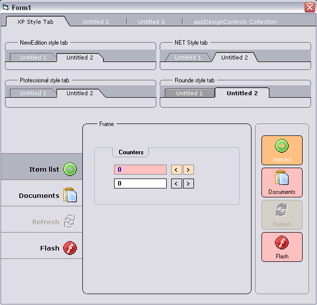



## appDesignControls Collection

### Description

There is new, and I think last version.

----

DECRIPTION: Cool collection of 6 controls. There is TAB, FRAME, IMAGE MENU, ITEM MENU, IMAGELIST and COUNTER controls.

If you like it PLEASE VOTE!
 
### More Info
 
there are many

             |
---                |---
**Submitted On**   |2006-07-23 00:34:26
**By**             |[ivan stimac](https://github.com/Planet-Source-Code/PSCIndex/blob/master/ByAuthor/ivan-stimac.md)
**Level**          |Intermediate
**User Rating**    |5.0 (50 globes from 10 users)
**Compatibility**  |VB 6\.0
**Category**       |[OLE/ COM/ DCOM/ Active\-X](https://github.com/Planet-Source-Code/PSCIndex/blob/master/ByCategory/ole-com-dcom-active-x__1-29.md)
**World**          |[Visual Basic](https://github.com/Planet-Source-Code/PSCIndex/blob/master/ByWorld/visual-basic.md)
**Archive File**   |[appDesignC2008297232006\.zip](https://github.com/Planet-Source-Code/ivan-stimac-appdesigncontrols-collection__1-65983/archive/master.zip)

